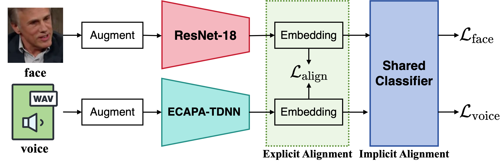

<div align="center">

# XM-ALIGN: Unified Cross-Modal Embedding Alignment for Face-Voice Association

[](https://pytorch.org/)
[](LICENSE)
[](https://arxiv.org/abs/2512.06757)

[](https://github.com/PunkMale/XM-ALIGN)
[](https://gitee.com/PunkMale/XM-ALIGN)

**[English](README.md) | [简体中文](README_ZH.md)**



</div>

---

## 📅 Project Progress

* [x] **MAV-Celeb Dataset Preparation**: Data processing scripts and directory specifications have been released.
* [x] **Training and Evaluation Code**: Full pipeline has been released.
* [ ] **MAV-Celeb Local Evaluation**: Will be supported once MAV-Celeb publishes evaluation labels.
* [ ] **VoxCeleb Extension**: Planned to support VoxCeleb cross-modal matching tasks in the future.

---

## 📁 Data Preparation

This project is primarily based on the MAV-Celeb dataset for face-voice association tasks. Please follow the steps below to prepare the data.

### Step 1: Download Data and Lists

Please download the raw dataset files and partition lists from the following links:

| Content                         | Description                                          | Download Link                                                                                                          |
| :------------------------------ | :--------------------------------------------------- | :--------------------------------------------------------------------------------------------------------------------- |
| **Dataset**                     | Raw audio and image data for v1 & v3                 | [Google Drive: MAV-Celeb v1 & v3 datasets](https://drive.google.com/drive/folders/1OJyjXJULErvrvzLQmpJn5v8rRo0n_fod)   |
| **Data Lists**                  | Partition files for training and testing sets (.txt) | [Google Drive: MAV-Celeb v1 & v3 data lists](https://drive.google.com/drive/folders/1MEHtEVh9lSa9hNZxjEfNJnE3qrpm_PKw) |
| **Noise Dataset (MUSAN)**       | Noise dataset                                        | [MUSAN Dataset](https://www.openslr.org/17/)                                                                           |
| **Noise Dataset (RIRS_NOISES)** | Noise dataset                                        | [RIRS_NOISES Dataset](https://www.openslr.org/28/)                                                                     |

### Step 2: Organize Directory Structure

After unzipping the files, please organize the data according to the following directory structure:

```bash
data
├── musan/                  # MUSAN Dataset
├── RIRS_NOISES/            # RIRS_NOISES Dataset
├── v1                      # MAV-Celeb v1 Dataset
│   ├── faces
│   │   ├── English         # test set
│   │   ├── Urdu            # test set
│   │   ├── id0001          # train set (id folders)
│   │   └── idxxxx          # ...
│   └── voices
│       ├── English         # test set
│       ├── Urdu            # test set
│       ├── id0001          # train set (id folders)
│       └── idxxxx          # ...
├── v1_lists                # v1 Split Lists
│   ├── English_test.txt
│   ├── English_train.txt
│   ├── Urdu_test.txt
│   └── Urdu_train.txt
├── v3                      # MAV-Celeb v3 Dataset
│   ├── English_test        # test set
│   │   ├── faces
│   │   └── voices
│   ├── German_test         # test set
│   │   ├── faces
│   │   └── voices
│   ├── faces               # train set
│   └── voices              # train set
└── v3_lists                # v3 Split Lists
    ├── English_test.txt
    ├── English_train.txt
    ├── German_test.txt
    └── German_train.txt
```

## 📂 Project Structure

```shell
conf/                  # Directory for experiment configuration files
data/                  # Directory for datasets
exp/                   # Directory for experiment results and logs
module/
    audiomodel.py      # Audio model
    loss.py            # Loss functions
    visualmodel.py     # Visual model
dataLoader.py          # Data loading and preprocessing
main.py                # Main experiment workflow file, responsible for loading configurations, setting up the environment, and running training and evaluation
tools.py               # Utility functions
trainer.py             # Contains the training and evaluation code
```

## 🛠️ Training

### 1. **Environment Setup**

Before starting the training, ensure that your environment is properly configured. This project requires Python and specific libraries like PyTorch. Make sure to install the dependencies listed in the `requirements.txt` file.

```bash
pip install -r requirements.txt
```

### 2. **Training Configuration**

The training configuration is set in the `main.py` file, where we specify the experiment configuration and GPU settings. The following section shows how to set the GPU for training and load different experiment configurations.

```python
if __name__ == '__main__':
    os.environ["CUDA_VISIBLE_DEVICES"] = "0"  # Specify the GPU to use

    config_files = [
        'conf/#10_v3_ce_alignment_0.1_english.yaml', # English
        'conf/#10_v3_ce_alignment_0.1_german.yaml',  # German
    ]
    
    # Iterate through configuration files and start training the model
    for config_file in config_files:
        configs = parse_config_or_kwargs(config_file)
        main(configs)
```

### 3. **Configuration Files and Language Setup**

The experiment configuration files are stored in the `conf/` directory. Each configuration file specifies different parameters for the alignment task, including language settings (English, Urdu, German).

* For each experiment, the configuration file sets the model to train on two languages (`english-urdu` or `english-german`).

### 4. **Run Training**

```bash
python main.py
```

### 5. **Model Output**

The training output will be stored in the `exp/` directory. The following subdirectories will be generated based on the experiment configuration:

* `model_a` – Model trained on audio.
* `model_v` – Model trained on face images.
* `submission` – Contains submission results.
* `score.txt` – Logs the performance metrics of the trained model.
* `train.log` – Logs the training process.

## 📊 Evaluation

### 1. **Evaluation Directory Structure**

Each experiment will generate different directories based on the two language setups. For example, for the `v3` dataset, you will get the following two directories:

* `exp/v3_***_english/`

  * `submission/`

    * `sub_score_English_heard.txt`: English training set evaluation results.
    * `sub_score_German_unheard.txt`: German unseen test set evaluation results.
* `exp/v3_***_german/`

  * `submission/`

    * `sub_score_English_unheard.txt`: English unseen test set evaluation results.
    * `sub_score_German_heard.txt`: German training set evaluation results.

### 2. **MAV-Celeb Evaluation Set Processing**

Since the MAV-Celeb dataset does not provide real labels for the evaluation set, some processing is required to generate the final evaluation results. You need to organize the following four evaluation files into the same directory:

* `sub_score_English_heard.txt`
* `sub_score_German_unheard.txt`
* `sub_score_English_unheard.txt`
* `sub_score_German_heard.txt`

### 3. **Pack and Submit Evaluation Results**

Place these four `.txt` files in the same directory and package them into a `.zip` file:

```bash
zip archive.zip *.txt
```

After packaging, you will get a zip file named `archive.zip`, which contains all the evaluation result files.

Then, submit the `archive.zip` to CodaBench for evaluation. Please visit the following link and submit your evaluation results: [CodaBench Submission Link](https://www.codabench.org/competitions/9467)

## 📚 Citation

If this project has been helpful to your research, please cite our paper:

```bibtex
@misc{fang2025xmalign,
      title={XM-ALIGN: Unified Cross-Modal Embedding Alignment for Face-Voice Association}, 
      author={Zhihua Fang and Shumei Tao and Junxu Wang and Liang He},
      year={2025},
      eprint={2512.06757},
      archivePrefix={arXiv},
      primaryClass={cs.SD},
      url={https://arxiv.org/abs/2512.06757}, 
}
```
