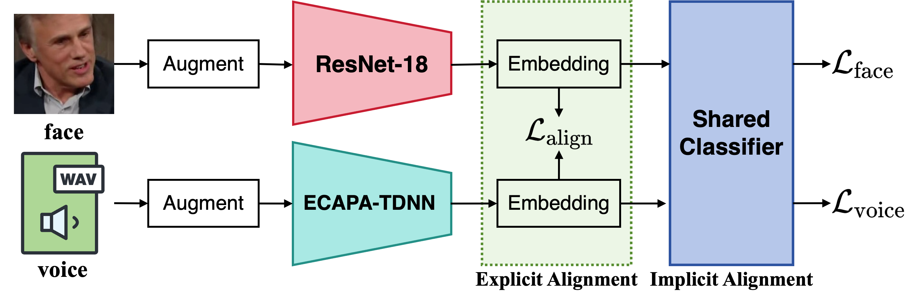

<div align="center">

# XM-ALIGN: Unified Cross-Modal Embedding Alignment for Face-Voice Association

[](https://ieeexplore.ieee.org/abstract/document/11463876)
[](https://arxiv.org/abs/2512.06757)

[](https://github.com/PunkMale/XM-ALIGN)
[](https://gitee.com/PunkMale/XM-ALIGN)

**[English](README.md) | [简体中文](README_ZH.md)**



</div>

---

## 📅 项目进度

- [x] **MAV-Celeb 数据集准备**：已发布数据处理脚本与目录规范。
- [x] **训练与评估代码**：已发布完整 pipeline。
- [ ] **MAV-Celeb 本机评估**：未来 MAV-Celeb 公布评估标签后将会支持。
- [ ] **VoxCeleb 扩展**：计划在未来支持 VoxCeleb 跨模态匹配任务。

---

## 📁 数据准备

本项目主要基于 MAV-Celeb 数据集进行人脸-语音关联任务。请按照以下步骤准备数据。

### Step 1: 下载数据与列表

请从以下链接下载原始数据集文件及划分列表：

| 内容 | 说明 | 下载链接 |
| :--- | :--- | :--- |
| **Dataset** | 包含 v1 & v3 的原始音频与图像数据 | [Google Drive: MAV-Celeb v1 & v3 datasets](https://drive.google.com/drive/folders/1OJyjXJULErvrvzLQmpJn5v8rRo0n_fod) |
| **Data Lists** | 包含训练集与测试集的划分文件 (.txt) | [Google Drive: MAV-Celeb v1 & v3 data lists](https://drive.google.com/drive/folders/1MEHtEVh9lSa9hNZxjEfNJnE3qrpm_PKw) |
| **Noise Dataset (MUSAN)**       | 噪声数据集 | [MUSAN 数据集](https://www.openslr.org/17/)                                                                               |
| **Noise Dataset (RIRS_NOISES)** | 噪声数据集 | [RIRS_NOISES 数据集](https://www.openslr.org/28/)                                                                         |


### Step 2: 目录结构整理

解压上述文件后，请严格按照以下目录结构整理数据：

```bash
data
├── musan/                  # MUSAN Dataset
├── RIRS_NOISES/            # RIRS_NOISES Dataset
├── v1                      # MAV-Celeb v1 Dataset
│   ├── faces
│   │   ├── English         # test set
│   │   ├── Urdu            # test set
│   │   ├── id0001          # train set (id folders)
│   │   └── idxxxx          # ...
│   └── voices
│       ├── English         # test set
│       ├── Urdu            # test set
│       ├── id0001          # train set (id folders)
│       └── idxxxx          # ...
├── v1_lists                # v1 Split Lists
│   ├── English_test.txt
│   ├── English_train.txt
│   ├── Urdu_test.txt
│   └── Urdu_train.txt
├── v3                      # MAV-Celeb v3 Dataset
│   ├── English_test        # test set
│   │   ├── faces
│   │   └── voices
│   ├── German_test         # test set
│   │   ├── faces
│   │   └── voices
│   ├── faces               # train set
│   └── voices              # train set
└── v3_lists                # v3 Split Lists
    ├── English_test.txt
    ├── English_train.txt
    ├── German_test.txt
    └── German_train.txt
```

## 📂 项目结构

```shell
conf/                  # 存放实验配置文件的目录
data/                  # 存放数据集的目录
exp/                   # 存放实验结果和日志的目录
module/
    audiomodel.py      # 音频模型
    loss.py            # 损失函数
    visualmodel.py     # 视觉模型
dataLoader.py          # 数据加载和预处理
main.py                # 主实验流程文件，负责加载配置、设置环境和启动训练与评估过程
tools.py               # 工具函数
trainer.py             # 包含训练和评估

```

## 🛠️ 训练

### 1. **环境设置**

在开始训练之前，确保你的环境已经正确配置。该项目需要 Python 和一些特定的库，如 PyTorch。请确保安装了 `requirements.txt` 文件中的依赖。

```bash
pip install -r requirements.txt
```

### 2. **训练配置**

训练配置在 `main.py` 文件中设置，指定了实验的配置和 GPU 设置。以下部分展示了如何设置训练时使用的 GPU 以及加载不同的实验配置。

```python
if __name__ == '__main__':
    os.environ["CUDA_VISIBLE_DEVICES"] = "0"  # 指定使用的 GPU

    config_files = [
        'conf/#10_v3_ce_alignment_0.1_english.yaml', # 英语
        'conf/#10_v3_ce_alignment_0.1_german.yaml',  # 德语
    ]
    
    # 遍历配置文件并开始训练模型
    for config_file in config_files:
        configs = parse_config_or_kwargs(config_file)
        main(configs)
```

### 3. **配置文件和语言设置**

实验的配置文件存放在 `conf/` 目录下。每个配置文件指定了对齐任务的不同参数，包括语言设置（英语、乌尔都语、德语）。

* 对于每个实验，配置文件设置了模型在两种语言（`english-urdu` 或 `english-german`）上的训练。

### 4. **运行训练**

```bash
python main.py
```

### 5. **模型输出**

训练的输出将存储在 `exp/` 目录下。将根据实验配置生成以下子目录：

* `model_a`：在语音上训练的模型。
* `model_v`：在人脸上训练的模型。
* `submission`：包含提交的结果。
* `score.txt`：记录训练模型的性能指标。
* `train.log`：记录训练过程的日志。

## 📊 评估

### 1. **评估目录结构**

每个实验会根据两种语言设置生成不同的实验目录。例如，针对 `v3` 数据集，我们会得到如下两个目录：

* `exp/v3_***_english/`
  * `submission/`
    * `sub_score_English_heard.txt`：英语训练集评估结果。
    * `sub_score_German_unheard.txt`：德语未见测试集评估结果。
* `exp/v3_***_german/`
  * `submission/`
    * `sub_score_English_unheard.txt`：英语未见测试集评估结果。
    * `sub_score_German_heard.txt`：德语训练集评估结果。

### 2. **MAV-Celeb 评估集处理**

由于 MAV-Celeb 数据集并没有提供评估集的真实标签，因此需要做一些处理来生成最终的评估结果。你需要将以下四个评估文件整理到同一个目录中：

* `sub_score_English_heard.txt`
* `sub_score_German_unheard.txt`
* `sub_score_English_unheard.txt`
* `sub_score_German_heard.txt`

### 3. **打包评估结果并提交**

将这四个 `.txt` 文件放置在同一目录下，并打包为 `.zip` 文件：

```bash
zip archive.zip *.txt
```

打包完成后，生成一个名为 `archive.zip` 的压缩文件，包含了所有评估结果文件。

然后，你需要将 `archive.zip` 提交到 CodaBench 进行评估。请访问以下链接并提交你的评估结果：[CodaBench 提交地址](https://www.codabench.org/competitions/9467)


## 📚 引用
如果本项目对您的研究有帮助，请引用我们的论文：
```bibtex
@INPROCEEDINGS{11463876,
  author={Fang, Zhihua and Tao, Shumei and Wang, Junxu and He, Liang},
  booktitle={ICASSP 2026 - 2026 IEEE International Conference on Acoustics, Speech and Signal Processing (ICASSP)}, 
  title={XM-ALIGN: Unified Cross-Modal Embedding Alignment for Face-Voice Association}, 
  year={2026},
  pages={21760-21762},
  doi={10.1109/ICASSP55912.2026.11463876}
}
```
